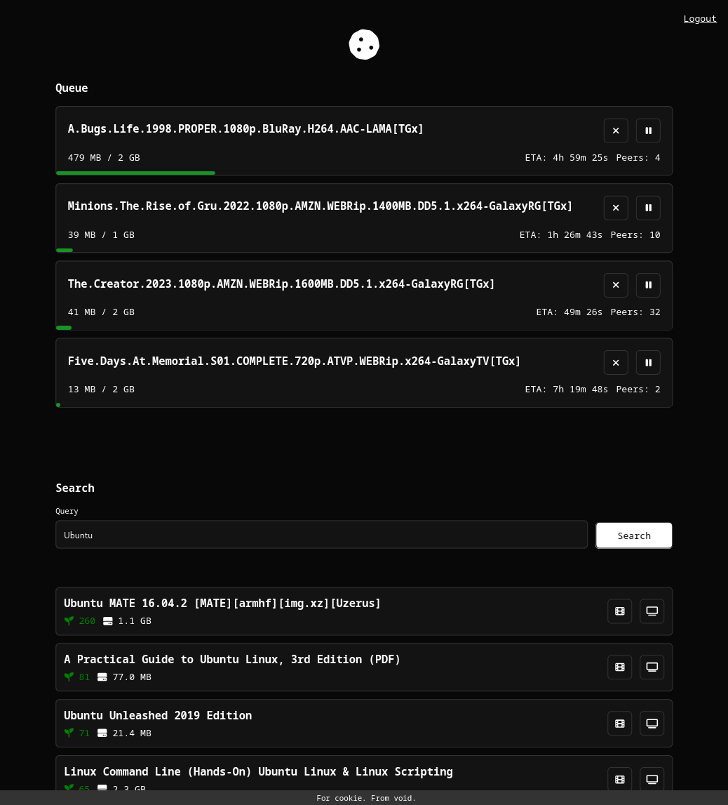

# cookie frontend

This is the frontend for the cookie project.

Wife wanted a nice easy way to download the latest operating systems through torrents.



To get started with the frontend for the cookie project, make sure you have Node.js installed. Then, run the following command to install the necessary dependencies:

```bash
npm install
```

Once the installation is complete, you can start the frontend by running:

```bash
npm start
```

This will launch the application and you can access it in your browser.